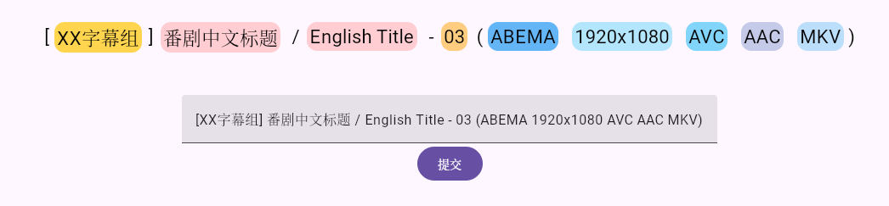

# TSLM WebUI



TSLM WebUI is a Kotlin Multiplatform web interface and HTTP service for the
[TSLM](https://github.com/TorrenKt/tslm-java) torrent-title recognition model.
It serves a Compose for Web frontend and a Ktor API from one JVM process.

## Project Layout

```text
.
├── tslm-java/      # Git submodule: TSLM inference library
└── tslm-server/    # Ktor server and Compose for Web client
```

`tslm-java` is a Gradle subproject and is required to build the server.

## Requirements

- JDK 21
- Docker, for container builds
- NVIDIA driver and NVIDIA Container Toolkit, for CUDA inference
- A TSLM ONNX model

The GPU model is `tslm-b-fp16.onnx`; use the CPU model with
`TSLM_WEBUI_USE_CUDA=false` when CUDA is unavailable.

## Clone And Build

Clone with submodules:

```bash
git clone --recurse-submodules <repository-url>
```

For an existing checkout:

```bash
git submodule update --init --recursive
```

Build a local JVM distribution, including the production WebAssembly client:

```bash
./gradlew :tslm-server:installJvmDist
```

The runnable distribution is written to:

```text
tslm-server/build/install/tslm-server-jvm/
```

## Docker

The project provides production and development Docker build tasks.

```bash
# Builds the production image. HEAD must have a vMAJOR.MINOR.PATCH tag, or set
# docker.releaseVersion in gradle.properties.
./gradlew :tslm-server:buildDockerImage

# Builds the JVM distribution locally, then copies it into a runtime image.
./gradlew :tslm-server:buildDevDockerImage
```

Production images are published to GitHub Container Registry as
`ghcr.io/torrenkt/tslm-webui`. Both runtime images use CUDA 12.9 with cuDNN
and install Zulu 21.

## Deploy A Public Instance

A public instance does not require PostgreSQL, a super token, or a database
network. It requires Docker Compose, an NVIDIA driver, and the NVIDIA Container
Toolkit. The model file must be available on the host.

Create a `compose.yaml` next to a writable `data/` directory:

```yaml
services:
  tslm-webui:
    image: ghcr.io/torrenkt/tslm-webui:v1
    ports:
      - "2156:2156"
    restart: always
    volumes:
      - ./data/model:/app/model:ro
      - ./data/nv-cache:/root/.nv/ComputeCache
    environment:
      TSLM_WEBUI_PORT: "2156"
      TSLM_WEBUI_PUBLIC_INSTANCE: "true"
      TSLM_WEBUI_USE_CUDA: "true"
      TSLM_WEBUI_FLAVOR: "TSLM_B" # or TSLM_C
    deploy:
      resources:
        reservations:
          devices:
            - driver: nvidia
              capabilities: [gpu]
              count: 1
```

The `nv-cache` mount persists the CUDA driver JIT cache generated during model
preheating and is recommended for faster subsequent starts.

Start the service:

```bash
docker compose up -d
```

Open `http://<host>:2156`. To update the image, run
`docker compose pull && docker compose up -d`.

For CPU inference, remove the `deploy.resources.reservations.devices` section,
set `TSLM_WEBUI_USE_CUDA` to `"false"`, and mount a CPU-compatible model.

## License

Copyright 2026 TorrenKt.

Licensed under the [Apache License, Version 2.0](LICENSE).
